# longitudinal-health-foundation-model

[](#)
[](#)
[](LICENSE)
[](#)
[](paper/ethics.md)

**Self-supervised multimodal modeling of wearable, smartphone, and environmental signals for personalized behavioral health risk prediction.**

> *Research prototype. Synthetic data only. Not a medical device. Not for clinical use.*

[](https://colab.research.google.com/github/ceyhunolcan/longitudinal-health-foundation-model/blob/main/notebooks/00_quickstart.ipynb)

## 60-second demo

```bash
git clone https://github.com/ceyhunolcan/longitudinal-health-foundation-model.git
cd longitudinal-health-foundation-model
make install        # cpu torch + project deps
make demo           # synthetic cohort -> features -> tiny train -> AUROC
```

After ~60s on a laptop you'll see something like:

```
── 4/4  evaluate (participant-clustered bootstrap CI) ──────────────────
  task              AUROC      95% CI            AUPRC   ECE     n_test
    low_mood          0.74     [0.69, 0.79]      0.61    0.07    412
    high_stress       0.71     [0.65, 0.76]      0.43    0.08    412
    sleep_disruption  0.79     [0.74, 0.84]      0.52    0.06    412
    climate_vulnerable 0.83    [0.74, 0.91]      0.31    0.09    412
```

Then `lhfm dashboard` (or `streamlit run src/lhfm/dashboard/app.py`) for the
interactive explorer, or open the [Colab notebook](notebooks/00_quickstart.ipynb)
to skip the local install entirely.

---

LHFM is a reproducible research scaffold for one specific question:
*can a self-supervised foundation model over multimodal passive-sensing
data learn representations that are useful for personalized behavioral
health risk prediction?* The repository ships a 250-participant × 90-day
synthetic cohort, a modular feature-engineering pipeline, a multimodal
transformer encoder pretrained with three SSL objectives, four downstream
risk heads, a FastAPI inference service, a Streamlit dashboard, classical
baselines, tests, and documentation. The goal is to make the methodological
choices legible and testable, not to make any clinical claim.

## Why this project exists

Wearable + smartphone passive sensing has matured to the point where
year-scale, sub-daily resolution data on sleep, autonomic load, behavior,
and environment is technically routine. The methodological gap is no
longer data; it is principled representation learning that:

1. **handles heavy, informative missingness** (people skip surveys and
   take off watches on the days we most care about),
2. **respects personal baselines** (population-mean reasoning is wrong
   for an individual whose resting HR has always been 48 bpm),
3. **fuses asynchronous modalities** (wearable, phone, EMA, environment),
4. **uses self-supervision** to amortize the labelling problem, and
5. **takes climate context seriously** as a covariate of physiology and
   mood.

LHFM exists to make those concerns concrete: each is a separate, testable
piece of the codebase.

## Architecture

```mermaid
%%{init: {'theme':'neutral', 'flowchart': {'curve': 'basis', 'nodeSpacing': 40, 'rankSpacing': 50}}}%%
flowchart TB
    subgraph SRC ["data sources"]
        SYNTH["<b>synthetic</b><br/>generator"]
        LS["<b>LifeSnaps</b><br/>Kaggle / Zenodo"]
        GLOBEM["<b>GLOBEM</b><br/>PhysioNet"]
    end
    SRC -->|adapter layer| LONG
    LONG["<b>long-form dataframe</b><br/>participant × day × modality"]
    LONG --> FE
    subgraph FE ["feature engineering"]
        direction LR
        WF["wearable"]
        SF["smartphone"]
        CF["climate"]
        MF["missingness"]
        BF["baseline"]
    end
    FE --> FEATS
    FEATS["<b>engineered features</b><br/>64-column daily panel"]
    FEATS --> PROJ
    FEATS --> MASK
    subgraph PROJ ["per-modality projectors"]
        direction LR
        PW["wearable MLP"]
        PS["smartphone MLP"]
        PC["climate MLP"]
    end
    MASK["missingness<br/>mask embedding"]
    PROJ --> SUM
    MASK --> SUM
    PARTID["participant<br/>embedding<br/><i>(optional)</i>"] --> SUM
    SUM["sum + LayerNorm"]
    SUM --> POSENC
    POSENC["sinusoidal pos enc<br/>+ Transformer (3 × 4 heads)<br/>mask-aware attention"]
    POSENC --> POOL
    POOL["attention-pool over T"]
    POOL --> SSL
    POOL --> DOWN
    subgraph SSL ["self-supervised heads"]
        direction LR
        REC["masked<br/>reconstruction"]
        NXT["next-day<br/>prediction"]
        CON["contrastive"]
    end
    subgraph DOWN ["downstream heads"]
        direction LR
        T1["low mood"]
        T2["high stress"]
        T3["sleep disruption"]
        T4["climate vulnerable"]
    end
    DOWN --> AUDIT
    subgraph AUDIT ["evaluation"]
        direction LR
        BOOT["participant-clustered<br/>bootstrap CI"]
        FAIR["subgroup<br/>fairness audit"]
        CLIM["climate-regime<br/>holdout"]
        IG["integrated-gradients<br/>interpretability"]
    end
    classDef src fill:#e3f2fd,stroke:#1976d2,stroke-width:1px
    classDef feat fill:#f3e5f5,stroke:#7b1fa2,stroke-width:1px
    classDef enc fill:#fff3e0,stroke:#e65100,stroke-width:1px
    classDef head fill:#e8f5e9,stroke:#2e7d32,stroke-width:1px
    classDef eval fill:#fce4ec,stroke:#c2185b,stroke-width:1px
    class SYNTH,LS,GLOBEM,LONG src
    class WF,SF,CF,MF,BF,FEATS feat
    class PW,PS,PC,MASK,SUM,POSENC,POOL,PARTID enc
    class REC,NXT,CON,T1,T2,T3,T4 head
    class BOOT,FAIR,CLIM,IG eval
```



> Source: [`docs/figures/architecture.mmd`](docs/figures/architecture.mmd). See [`docs/architecture.md`](docs/architecture.md) for the *why* of each design choice.

## Repository layout

```
configs/                  YAML configs (default, model, features)
data/                     synthetic/, processed/, raw/   (gitignored payloads)
src/lhfm/                 the importable package — `from lhfm import …`
  data/                   synthetic generator, preprocessing, validation
  features/               per-modality feature engineering modules (causal stats)
  models/                 encoder, transformer, SSL, downstream heads
  training/               SSL + downstream training loops, evaluation, baselines
  api/                    FastAPI app + pydantic schemas
  dashboard/              Streamlit app
  utils/                  config, logging, metrics, plotting, fairness, climate_regimes
  interpretability.py     integrated-gradients attribution (faithful explanations)
scripts/                  run_pipeline / train_model / evaluate_model /
                          run_fairness_audit / run_scale_ablation /
                          run_climate_holdout / export_release / launch_dashboard
notebooks/                4 walkthrough notebooks
paper/                    abstract, methods, model card, data card, ethics, limitations
tests/                    pytest suite (11 modules: data, features, models, API,
                          metrics, training, interpretability, fairness, regressions…)
results/                  figures and tables produced by training runs
checkpoints/              trained weights + .meta.json sidecars (gitignored)
releases/                 bundled artifacts produced by `make release-bundle`
```

The package is installed editable as `lhfm`, not `src` — every import in the
codebase reads `from lhfm.…`. Scripts add `src/` to `sys.path` so they work
without `pip install -e .` for quick iteration.

## Quickstart

```bash
make install-dev          # cpu torch + project + dev tools
make data train           # synthetic cohort → engineered features → SSL + downstream
make api                  # /docs on http://localhost:8000
make dashboard            # http://localhost:8501
make test                 # full pytest with coverage
make help                 # list every target
```

### As a Python library

After `pip install -e .` the most common workflow is a five-liner:

```python
import lhfm

df       = lhfm.generate_synthetic_cohort(n_participants=100, n_days=60, seed=42)
# or:  df = lhfm.load_cohort("lifesnaps", raw_dir="data/raw/lifesnaps")
features = lhfm.build_full_feature_table(df, impute=True, add_targets=True)
windows, y, pids, _ = lhfm.build_windows(features, feature_cols=[...], target_col="target_low_mood")
```

`import lhfm` exposes everything in `lhfm.__all__`: cohort generation,
adapter access (`get_adapter`, `list_adapters`, `load_cohort`),
preflight, feature engineering, windowing, split utilities, and
`load_downstream_checkpoint` for inference on a trained model.
Submodules (`lhfm.utils.fairness`, `lhfm.interpretability`,
`lhfm.training.evaluate`, etc.) are reachable via fully-qualified
imports for everything else.

### As a CLI

After `pip install -e .` the `lhfm` command is on your PATH:

```bash
lhfm --help
lhfm pipeline --adapter synthetic --participants 100 --days 60
lhfm pipeline --adapter lifesnaps --raw-dir data/raw/lifesnaps --preflight
lhfm train
lhfm fairness-audit --fail-on-violation
lhfm climate-holdout --holdout heat_wave
lhfm dashboard
```

The CLI is a thin multiplexer over `scripts/*.py` — every subcommand
still works as `python scripts/<name>.py ...` if you prefer.

### Evaluation pipeline

```bash
make train-ema-blind      # the methodologically honest run (no EMA features)
make evaluate             # re-evaluate the latest checkpoint with cluster CIs
make fairness-audit       # per-subgroup AUROC + equalized-odds gaps
make scale-ablation       # train at 10/25/50/100/250 participants → scaling figure
make climate-holdout      # hold out heat-wave windows, evaluate on them
make release-bundle       # produce releases/<run_tag>/ with model card + SHA256SUMS
```

### Local (Python 3.11+), step-by-step

```bash
git clone https://github.com/ceyhunolcan/longitudinal-health-foundation-model.git
cd longitudinal-health-foundation-model

python -m venv .venv
source .venv/bin/activate          # on Windows: .venv\Scripts\activate
pip install -e ".[dev]"            # editable install + dev tools

# 1. Generate synthetic data + run feature engineering
lhfm pipeline                       # or: python scripts/run_pipeline.py

# 2. Train SSL encoder + downstream risk heads, write metrics tables
lhfm train                          # or: python scripts/train_model.py

# 2b. (optional) re-evaluate the saved checkpoint without retraining
lhfm evaluate --bootstrap-resamples 2000 --split test

# 3. Browse the cohort in Streamlit
lhfm dashboard                      # or: streamlit run src/lhfm/dashboard/app.py

# 4. Serve predictions over HTTP
uvicorn lhfm.api.main:app --reload --port 8000
# open http://localhost:8000/docs for the auto-generated Swagger UI
```

### Docker

```bash
docker compose build
docker compose up -d
# API at http://localhost:8000
# Dashboard at http://localhost:8501
```

The compose file mounts `./data` and `./checkpoints` so generated data and
trained weights persist across container restarts.

### Running the tests

```bash
pip install pytest
pytest -q
```

Tests gracefully skip blocks for which the underlying library is missing
(e.g. `test_models.py` skips when torch is unavailable; `test_api.py`
skips when FastAPI is unavailable).

## Example: scoring a 14-day window

```python
import requests, datetime as dt

profile = {
    "participant_id": "DEMO_001",
    "age": 34, "sex": "F",
    "chronotype": "intermediate",
    "baseline_sleep_need": 7.6, "baseline_hrv": 58.0,
}

today = dt.date.today()
window = [
    {
        "date": (today - dt.timedelta(days=13 - i)).isoformat(),
        "sleep_duration": 7.0 - 0.3*(i % 3),
        "sleep_efficiency": 0.86,
        "hrv_rmssd": 55.0 + (i % 5),
        "resting_hr": 62.0,
        "survey_mood": 5.0 if i % 4 else 3.0,
        "survey_stress": 3.0 if i % 4 else 5.5,
        "temperature_c": 24.0 + (i % 7),
        "humidity": 55.0, "aqi": 60.0, "heat_index": 25.0,
    }
    for i in range(14)
]

r = requests.post("http://localhost:8000/predict",
                  json={"profile": profile, "window": window})
print(r.json())
```

A typical response (rule-based fallback shown; a trained checkpoint
replaces the probabilities):

```json
{
  "participant_id": "DEMO_001",
  "window_end_date": "2025-05-14",
  "low_mood_risk":          {"probability": 0.31, "label": "low"},
  "stress_risk":            {"probability": 0.58, "label": "moderate"},
  "sleep_disruption_risk":  {"probability": 0.12, "label": "low"},
  "climate_vulnerability_risk": {"probability": 0.08, "label": "low"},
  "explanation": [
    "Sleep efficiency below 80% on the latest day...",
    "Apparent temperature is elevated (32.4°C)."
  ],
  "confidence": 0.41,
  "model_loaded": false,
  "disclaimer": "Research prototype. Not a medical device."
}
```

## Example outputs

After `scripts/train_model.py` completes you'll have:

- `results/tables/metrics_test.csv`   per-task AUROC / AUPRC / F1 / ECE / Brier with bootstrap 95% CIs
- `results/tables/baselines.csv`      logistic regression / RF / XGBoost
- `results/tables/metrics_test.json`  same numbers, JSON form
- `results/figures/calibration_<task>.png` and `results/figures/confusion_<task>.png`
- `checkpoints/ssl.pt`                SSL-pretrained encoder weights
- `checkpoints/downstream.pt`         encoder + risk-head weights (loaded by API)
- `checkpoints/downstream.meta.json`  architecture + training metadata sidecar

> All numbers in those files come from a synthetic cohort generated under
> the assumptions documented in `paper/data_card.md`. They are sanity
> evidence that the pipeline trains end-to-end and that the architecture
> isn't broken. They are **not** estimates of real-world performance and
> must not be cited as such.

The `04_evaluate_downstream_tasks.ipynb` notebook walks through plotting
the foundation-model-vs-baselines comparison and the per-task calibration
curves.

## What we cannot claim

This is a deliberately narrow research prototype. To make it explicit, this
codebase **cannot** support any of the following claims:

- That the model's AUROC on real patient data will look anything like its
  AUROC on the synthetic test split.
- That any subgroup gets fair treatment under the model. The synthetic
  generator does not stratify by race, ethnicity, socioeconomic status, or
  geography, so the data cannot reveal disparities that exist in real cohorts.
- That the four downstream tasks correspond to validated clinical
  instruments. "Low mood" here is `survey_mood <= 3` on a 1-7 EMA scale,
  not a depressive episode; `target_climate_vulnerable` is a hand-crafted
  rule that combines heat index with HRV deviation.
- That LHFM is fit for any decision concerning a real person.

The API does return faithful integrated-gradients attributions when a
trained model is loaded (the rule-based panel is only the no-model
fallback). But "faithful" means *faithful to what the model is doing*,
not "the model is right".

### The target-leakage caveat

Three of the four downstream tasks are thresholds on EMA items
(`survey_mood`, `survey_stress`, `sleep_efficiency`) that are themselves
present in the feature table. A model with EMA features in its input gets
to look at every preceding day's value of the very scale it's predicting
tomorrow — i.e., it can succeed by doing trivial next-day autoregression
on the target. That is not a foundation-model contribution.

The methodologically honest run is therefore the **EMA-blind variant**:

```bash
python scripts/train_model.py --exclude-ema-features --run-tag ema-blind
```

This drops `survey_*` columns from the feature matrix so the model has to
predict tomorrow's self-reported mood from passive sensing alone
(wearable + smartphone + climate + missingness pattern). Treat the EMA-
blind numbers as the primary evidence; the EMA-included numbers are for
diagnostic reference only.

See `paper/limitations.md` and `paper/ethics.md` for the full discussion.

## Roadmap to publication-grade quality

The repository now ships with the methodological scaffolding the
publication needs:

| capability                              | command                                            |
| --------------------------------------- | -------------------------------------------------- |
| Train SSL + downstream                  | `make train` / `python scripts/train_model.py`     |
| The EMA-blind protocol                  | `make train-ema-blind`                             |
| Re-evaluate a checkpoint (cluster CIs)  | `make evaluate`                                    |
| Subgroup fairness audit                 | `make fairness-audit`                              |
| Pretraining-scale ablation curve        | `make scale-ablation`                              |
| Climate-regime generalization study     | `make climate-holdout`                             |
| Faithful interpretability (IG)          | hit `/predict` with a loaded model                 |
| Build a release bundle (SHA256SUMS, model card) | `make release-bundle`                      |

What remains is **running it at scale on real data**. Concretely:

1. **Real-data adapter + IRB-ready data card** (the one remaining headline
   gap). The synthetic generator already carries the right schema
   (demographics, comorbidities, medications, cycle phase, climate
   regimes); the missing piece is an importer for a real cohort
   (PhysioNet's LifeSnaps, the GLOBEM cross-dataset benchmark, etc.). The
   synthetic generator stays as a CI fixture.
2. **Real subgroup disparities.** The synthetic prior generates each
   subgroup from the same causal structure, so on synthetic data the
   fairness audit should report no material gaps. The audit becomes
   load-bearing the moment real demographics enter the picture.
3. **Tighten the generator further if needed.** Current within-person
   mood-sleep correlation is ~0.37, which is in the realistic range; cold-
   weather effects, longer climate-regime episodes, and more medication
   confounders are all still room for refinement.

## Research framing

This repository operationalizes a small number of methodological hypotheses:

1. *Within-person normalization beats population normalization.* The model
   sees baseline-deviation features as first-class inputs and additionally
   learns a participant embedding.
2. *Missingness is information.* We pass per-modality dropout masks into
   the encoder rather than imputing then forgetting.
3. *Climate context is a real covariate.* Heat index and AQI sit alongside
   physiology in the encoder.
4. *Self-supervision can absorb informative missingness*. Masked
   reconstruction over a modality that is missing 12-20% of the time
   forces the encoder to lean on the others.

The repo is structured so each of these can be ablated by editing a YAML
file rather than rewriting code.

## Citation

Citation metadata lives in `CITATION.cff` — GitHub will render a "Cite this
repository" button from it. The shortform is:

```
@software{lhfm_2026,
  title  = {Longitudinal Health Foundation Model (LHFM)},
  author = {Olcan, Ceyhun},
  year   = {2026},
  url    = {https://github.com/ceyhunolcan/longitudinal-health-foundation-model},
  note   = {Research prototype. Synthetic data + public-cohort adapters. Not a medical device.}
}
```

If you fork this repo, please update both `CITATION.cff` and the URL above
before redistributing.

## License

MIT. See `LICENSE`. Note the explicit non-clinical disclaimer at the bottom.

## Ethics and limitations

Read `paper/ethics.md` and `paper/limitations.md` before extending this
work. The short version: LHFM is a methodological scaffold; using it to
make decisions about real people requires a great deal more than
swapping the synthetic data for real data.
